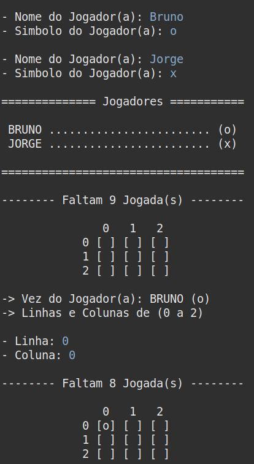
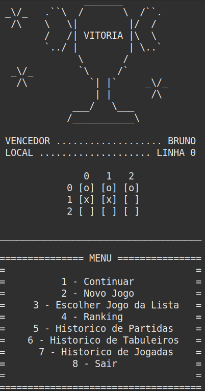

<h1 align="center">
    Jogo da Velha 
    Avaliação 3 de Programação II 
    UESPI - Universidade Estadual do Piauí
</h1>

## 🕹️ Jogo da Velha

O objetivo com este projeto é fazer o jogo da velha, utilizando boas práticas do uso da orientação a objetos e aplicando padrões de projetos. Os padrões utilizados foram: Singleton, Command e o Observer.

## 📁 Projeto
### 📍 Fazendo o clone do repositório:

    git clone https://github.com/brunnuscz/jogo_da_velha.git

### 📍 Você pode utilizar a IDE chamada Eclipse para rodar o projeto:

    https://www.eclipse.org/downloads/
    
### 📍 Lembre de instalar o JDK na sua máquina:

    https://www.oracle.com/br/java/technologies/downloads/

## 🗃 Estrutura do projeto

    ├── src
    │ ├── command
    │ │ └── Comando.java
    │ │ └── ContinuarComando.java
    │ │ └── JogoListaComando.java
    │ │ └── NovoJogoComando.java
    │ │ └── RankingComando.java
    │ ├── model
    │ │ └── Coordenada.java
    │ │ └── Dimensao.java
    │ │ └── Jogada.java
    │ │ └── Jogador.java
    │ │ └── Jogo.java
    │ │ └── Partida.java
    │ │ └── Resultado.java
    │ │ └── Tabuleiro.java
    │ ├── view
    │ │ └── InterfaceUsuario.java
    └───└── JogoDaVelha.java
    
## 🚩 Prévia

    
    

